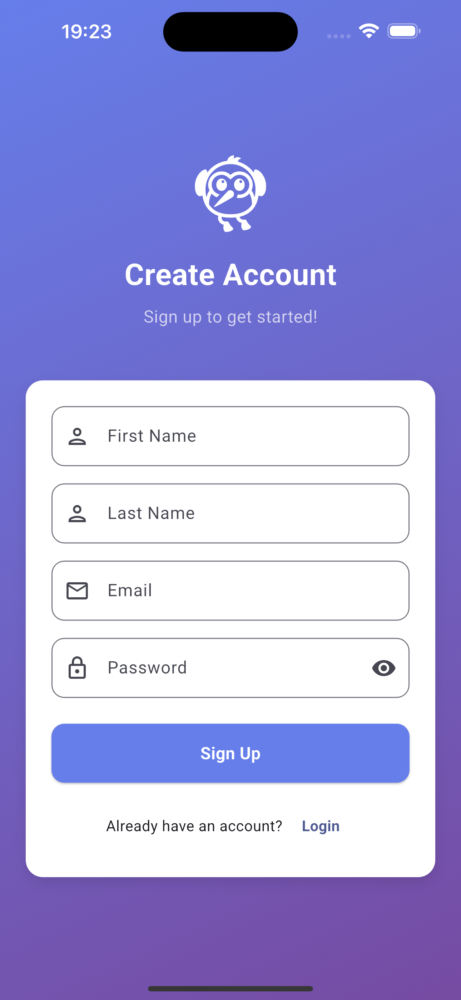
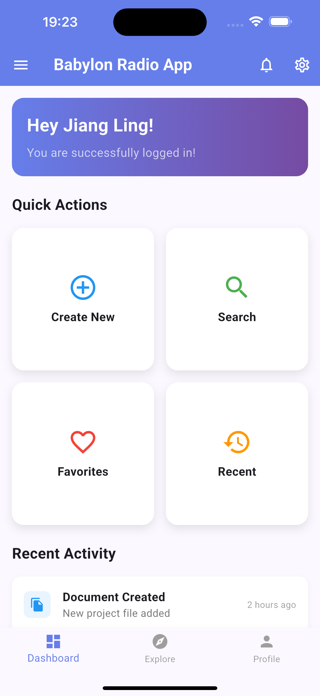
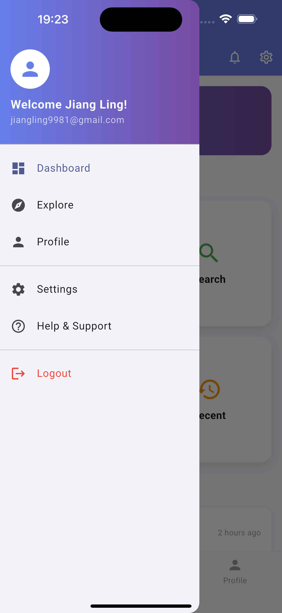
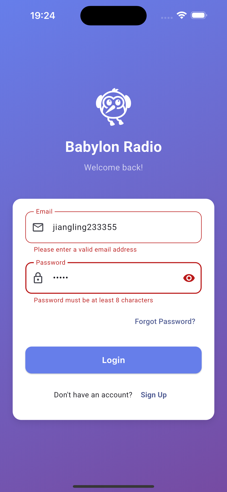

# Babylon Radio Flutter Assessment

[](https://flutter.dev)
[](#)
[](#)

---

## Overview

## This is a cross-platform Flutter app (iOS, Android, macOS desktop) featuring login/signup with Firebase Authentication and a personalized welcome home page.

## Features

- **Login Page**

  - Email and password login with validation
  - Error handling for invalid credentials and non-existent users
  - Password visibility toggle
  - Button to trigger login or registration
  - Checks for email and password match in Firestore collection "users"

- **Signup Page**

  - First name, last name, email, and password fields
  - Strong validation for all fields (length, format, allowed characters)
  - Checks for existing email in Firestore
  - Register new users and store their full name and email
  - Success and error feedback via SnackBar

- **Home Page**

  - Personalized welcome message ("Hey, <user name>, you are successfully logged in!") from Firestore
  - Drawer with user info, navigation, and logout
  - Bottom navigation bar (Dashboard, Explore, Profile)

- **Firebase Integration**

  - Uses `firebase_auth` for authentication
  - Uses `cloud_firestore` for user data
  - Ready for analytics with `firebase_analytics`

- **Testing**
  - Widget and unit tests for login and signup validation
  - Widget test for login with mocked FirebaseAuth and Firestore
  - Uses `mockito` for dependency injection and mocking

---

## Screenshots








---

## Getting Started

### Prerequisites

- **Flutter SDK** (>=3.8.0): [Install Flutter](https://docs.flutter.dev/get-started/install)
- **Dart SDK** (comes with Flutter)
- **Firebase Project**: [Firebase Console](https://console.firebase.google.com/)
- **Platform Tools:**
  - **Android:** Android Studio, Android SDK, emulator/device
  - **iOS/macOS:** Xcode, CocoaPods, simulator/device (macOS only runs on Mac)
  - **Windows/Linux:** Visual Studio (Windows), GTK (Linux), see [Flutter desktop docs](https://docs.flutter.dev/desktop)

### 1. Clone the Repository

```sh
git clone <https://github.com/lingjiang9/babylon-radio-app.git>
cd babylon_flutter_app
```

### 2. Install Dependencies

```sh
flutter pub get
```

This will fetch all Dart and Flutter dependencies listed in `pubspec.yaml`.

### 3. Configure Firebase

1. **Create a Firebase project** in the [Firebase Console](https://console.firebase.google.com/).
2. **Register your app** for each platform (iOS, Android, macOS) in the Firebase Console.
3. **Download configuration files:**
   - `google-services.json` → Place in `android/app/`
   - `GoogleService-Info.plist` → Place in `ios/Runner/` and `macos/Runner/`
4. **Generate `firebase_options.dart`:**
   - Install the FlutterFire CLI if you haven't:
     ```sh
     dart pub global activate flutterfire_cli
     ```
   - Run:
     ```sh
     flutterfire configure
     ```
   - This will generate `lib/firebase_options.dart` for your project.

### 4. Platform-Specific Setup

- **Android:**

  - Open an emulator or connect a device.

- **iOS/macOS:**
  - Run `cd ios && pod install` and `cd macos && pod install` if needed.
  - Open Xcode and accept any prompts for signing/certificates.

### 5. Run the App

- **Android/iOS:**
  ```sh
  flutter run
  ```
- **Web:**
  ```sh
  flutter run -d chrome
  ```
- **macOS**
  ```sh
  flutter run -d macos
  ```

---

## Project Structure

```
lib/
  main.dart                # App entry point, routing
  pages/
    login_page.dart        # Login UI and logic
    signup_page.dart       # Signup UI and logic
    home_page.dart         # Home/dashboard UI
  firebase_options.dart    # Firebase config (auto-generated)
test/
  login_page_test.dart         # Widget & validation tests for login
  signup_validation_test.dart  # Widget & validation tests for signup
  login_firestore_test.dart    # Widget test for login with mocked Firebase
```

---

## Running Tests

To run all tests:

```sh
flutter test
```

- Tests cover form validation, error handling, and Firebase/Firestore integration (with mocks).
- To regenerate mocks after changing test annotations:
  ```sh
  flutter pub run build_runner build
  ```

---

## Troubleshooting

- **Firebase errors:** Ensure your Firebase config files are in the correct platform folders and `firebase_options.dart` is up to date.
- **Tests fail due to mocks:** Run `flutter pub run build_runner build` to regenerate mock files after changing test annotations.
- **Platform-specific issues:** Make sure you have the correct platform SDKs and emulators installed.
- **Hot reload not working:** Try `flutter clean` and restart your IDE.

---

## Future Improvements

- Add password reset functionality.
- Improve accessibility (a11y) and localization.
- Add integration tests for navigation flows.
- Add CI/CD pipeline for automated testing and builds.
- Add dark mode and theme customization.
- Add user profile editing and avatar upload.

---

## Contact

For questions, contact **Ling Jiang** at [jiangling9981@gmail.com].

---

## License

This project is for educational/demo purposes. Add your own license as needed.
